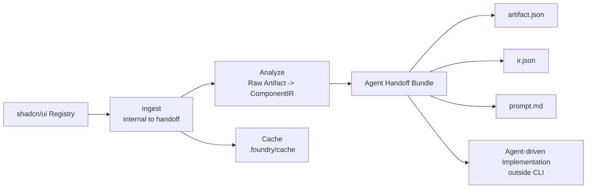
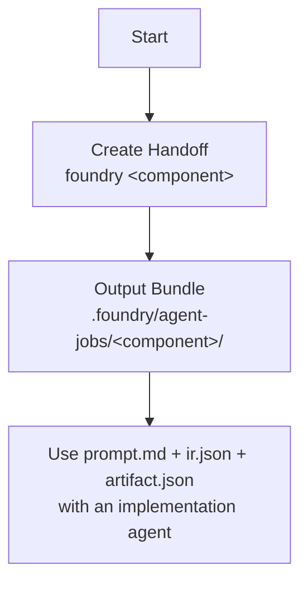

# shadcnui-foundry Workflow

This project now uses a prompt-first handoff model.

## End-to-End Flow



## Command-Level Workflow



## Practical Notes

- Default command is handoff: `foundry <component>`
- Explicit command is available: `foundry handoff <component>`
- The CLI does not perform downstream framework translation in this mode.

## Typical Run

```bash
pnpm --filter @shadcnui-foundry/cli run foundry -- accordion
pnpm --filter @shadcnui-foundry/cli run foundry -- handoff accordion --framework angular
```
